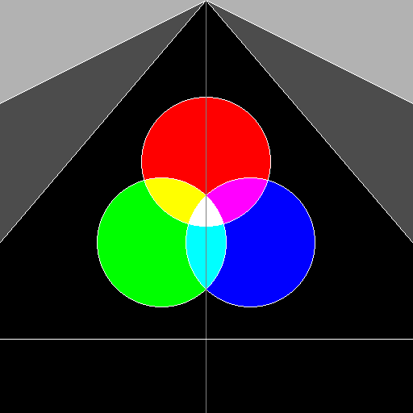

# PA0

陶天骅 2017010255 计81

### 主要工作内容

#### 填充 Bresenham 算法

使用书上的使用整数的 Bresenham 算法。需要注意的是，书上的代码只考虑了斜率k大于0小于1的情况，实际中，要分四种情况讨论才能得到完整版。具体地说，要比较dx和dy的绝对值大小，然后还要看xA和xB（yA和yB）的大小关系，必要的时候互换。

#### 填充画圆算法

根据书本，使用8分圆的画法。根据对称性，每次画8个点。

#### 填充 Flood fill 算法

使用 std::queue 实现基于BFS的填充算法，每次处理一个点的颜色，然后根据4连通判断邻像素的颜色是否需要改变，如果是则加入队列。要注意边界条件，不要画出了边界。

本次作业独立完成。

### 输出图片

