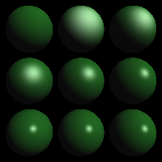

# PA2

陶天骅 2017010255 计81

### 主要工作内容

- 复制上一次作业的内容到这次的框架中
- 学习OpenGL
- 填充main和mesh

我尝试了在mac和Linux上配置OpenGL并运行，它们在`glReadBuffer(GL_FRONT)`问题上有不同的表现。其余的部分没有问题。

OpenGL的绘制不需要手动编写光线求交的逻辑，但是在绘制各个部件的时候，要改变状态机内的状态，然后根据特征绘制顶点，或者是改变灯光的状态。OpenGL用过程式的绘制方式，但是一般编写的程序会需要用到面向对象，所以要把绘制方法封装到对象中去。

本次作业独立完成。

### 输出图片

