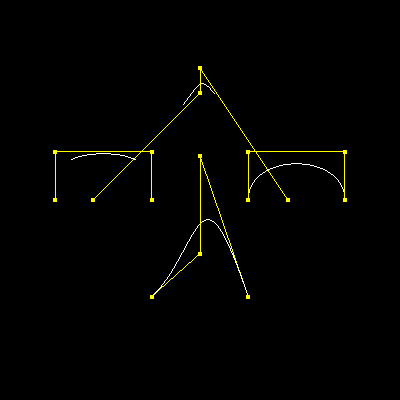
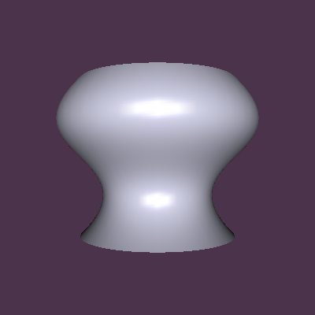

# PA3

陶天骅 2017010255 计81

### 主要工作内容

- 复制上一次作业的内容到这次的框架中
- 填充BezierCurve，新增以下函数：
  - `int binomialCoeff(int n, int i);`
  - `float computeBezBlendFcn(int n, int i, float t);`
  - `void computeBezPt(float t, float point[3]);`
  - `void computeBezTanPt(float t, float point[3]);`
- 填充BsplineCurve，新增以下函数：
  - `void computeKnots(std::vector<float> &knots);`
  - `float computeBsplineBlendFcn(int p, int i, float t, std::vector<float> &knots);`
  - `void computeBsplinePt(float t, float point[3], std::vector<float> &knots);`
  - `void computeBsplineTanPt(float t, float point[3], std::vector<float> &knots);`

作业中遇到的困难包括要注意边界值情况，特别注意处理不等号是否要取到等于。

Bezier 曲线和 B 样条曲线最大的差别在于 Bezier 曲线上的点的位置受所有的控制点影响，而 B 样条曲线上的点只受临近$k+1$个点的影响，在这次PA中，$k$取3. 当 $k$ 取 $n$（控制点个数为 $n + 1$）时，受到所有的控制点影响，就得到Bezier曲线。

为了得到首尾相接且接点处也有连续性质的 B 样条曲线，可以使最后的k个控制点和前k个一致，所有的控制点形成循环。

PA中绘制旋转曲面的过程，是将曲线分40次，旋转一圈，每次旋转使用4D矩阵，计算对应法向量，然后将旋转得到的平面储存起来，这样将连续曲面变成若干平面，绘制的时候按平面绘制。

本次作业独立完成。

### 输出图片

