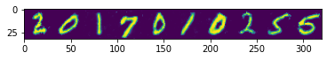
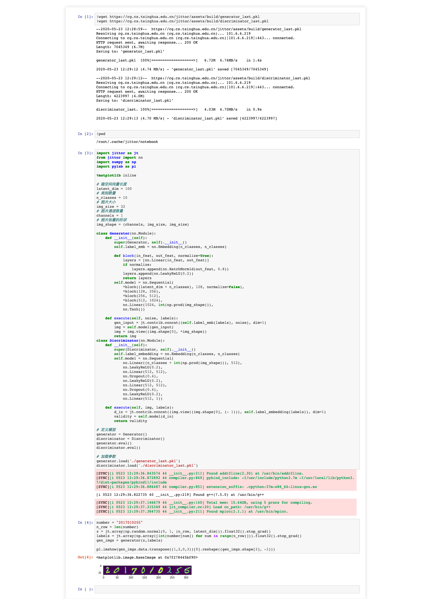

# PA4 GAN

陶天骅 2017010255 计81

## 任务内容

根据教程使用 jittor 生成学号图片。

我选择了在 Windows 上安装 Docker Desktop，使用`docker run -it -p 8888:8888 jittor/jittor`开启jupyter界面。

复制进`https://cg.cs.tsinghua.edu.cn/jittor/tutorial/2020-5-13-22-47-cgan/`的代码，运行生成学号图片。

运行代码可见附件`gan.html`，或最后的附图。

## 结果

